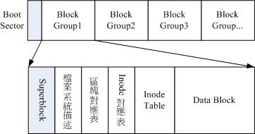
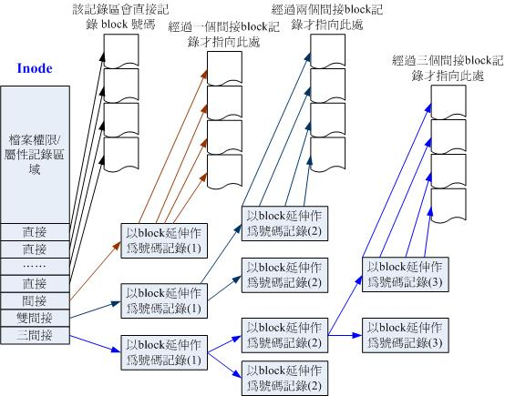

<head>
<link rel='stylesheet' href='/style/github2.css'/>
</head>

一步步理解Linux文件（1）--文件的基本概念
====================================

作者：[gaopenghigh](http://gaopenghigh.github.com)
，转载请注明出处。
[（原文地址）](http://gaopenghigh.github.io/posts/understanding_linux_step_by_step_file_1.html)

## 文件描述符

Linux把一切都看做文件，设备、管道、socket都可以看做文件，可以通过一个文件描述符来引用，对它们可以调用read()和write()等系统调用。文件描述符一般是一个正非负整数，一般情况下，文件描述符0，1，2分别代表标准输入、标准输出和标准出错。

在进程描述符`task_struct`中有一个元素files，这就是指向这个进程打开的文件描述符表。

## 虚拟文件系统概念

我们知道文件系统有很多种，Linux下的ext2, ext3, ext4, windows下的NTFS, 以及网络文件系统NFS等等，要把这么多文件系统，加上一些设备统统视作文件，能用统一的方法控制，Linux使用了所谓“虚拟文件系统”VFS。VFS有自己的一套概念，不管具体的文件系统是什么，要在Linux下能工作，就必须用VFS的框框来套。比如说，我们知道VFS中有inode的概念，某个文件系统使用数据库的方式来存取数据，那么为了在Linux下能够工作，就必须在驱动程序中就必须把数据信息转化为inode的方式。VFS相当于一套接口和规范，具体实现各个文件系统自己搞自己的，但表现出来的样子必须一样。

VFS采用的是面向对象的设计思路，但由于使用C来实现，所以这些面向对象的特性通过结构体来实现。

VFS有四种主要的对象类型：

* 索引节点对象(`struct inode`)

    Linux把文件的相关信息和文件本身这两个概念加以区分，前者包括文件类型，修改时间、所有者、大小、是否为脏等信息，这些信息与具体数据分开，放在单独的数据结构inode中，这个对象叫做索引节点对象。一个inode代表文件系统中的一个文件，但仅当文件被访问时，inode对象才会在内存中创建。

* 超级块对象(`struct super_block`)

    每个文件系统都有自己的信息，包括它的文件格式，内核所能调用的方法等，这些信息存储在所谓的超级块对象中。

* 文件对象(`struct file`)

    它代表进程打开的文件，也就是进程直接处理的东西。所以文件对象包含访问模式、当前偏移量等进程操作中进程使用的信息。同一个文件可能由多个进程打开，所以同一个文件可能在内存中存在对个对应的文件对象。由于同一文件的不同文件对象的当前偏移量不同，所以两个进程同时操作一个文件，可能会发生不可预知的结果。
    文件对象通过 `f_dentry` 指针指向相关的目录项对象，目录项对象又会指向相关的索引节点。

* 目录项对象(`struct dentry`)

    VFS把目录当做文件对待。随意在路径/bin/vi中，bin和vi都属于文件，虽然它们都可以统一由inode表示，但是为了查找方便，VFS引入了目录项（dentry）的概念。每个dentry代表路径中的一个部分。

    目录项对象没有对应的磁盘数据结构，VFS更具字符串形式的路径名现场创建它。

    目录项对象有三种有效状态：被使用、未被使用和负状态。

    一个目录项处于被使用状态表明它对应一个有效的inode，同时存在一个或多个使用者（dentry结构中的`d_count>0`）。它正在被VFS使用，不能被丢弃。

    一个目录项处于未被使用状态，表示它指向一个有效的inode，但是当前VFS并没有使用这个inode代表的文件（`d_count=0`）。

    负状态的目录项没有对应的有效inode，因为inode已经被删除了或者路径不正确。
    因为遍历路径中的所有元素并将它们逐个解析成目录项对象，是比较耗费资源的工作，所以内核将目录项对象缓存在目录项缓存dcache中。

每个主要对象中都包含一个操作对象，该操作对象描述了内核针对主要对象可以使用的所有方法。比如索引节点对象中包含`inode_operations`对象，里面又包括了内核针对特定文件所能调用的方法，比如create()和link()等方法。这些方法需要由各个文件系统的驱动做具体的实现。

## 文件类型

文件类型包含下面几种：

* 普通文件（regular file）。最常用的的文件类型，内容可能是文本或者二进制格式。
* 目录文件（directory file）。文件中包含了其它文件的名字以及指向它们信息的指针。
* 块特殊文件（block special file）。提供对设备（例如磁盘）的带缓冲的访问，每次访问以固定长度为单位进行。
* 字符特殊文件（character special file）。提供对设备不带缓冲的访问，每次访问长度可变。系统中的设备要么是字符特殊文件，要么是块特殊文件。
* FIFO。即命名管道，用于进程间通信。
* 套接字（socket）。用于网络通信或进程间的通信。
* 符号链接（symbolic link）。指向另一个文件的文件。

## 硬链接和符号链接（hard link & symbolic link）

简单地说，硬链接和原文件中的inode编号是同一个，也就是共享同一个inode。如图：

        ! filename ! inode # !
        +--------------------+
                        \
                         >--------------> ! permbits, etc ! addresses !
                        /                 +---------inode-------------+
        ! othername ! inode # !
        +---------------------+

符号链接的则是指向了另外的文件，也就是说符号链接的文件内容就是另外一个文件的路径，如图：

        ! filename ! inode # !
        +--------------------+
                        \
                         .-------> ! permbits, etc ! addresses !
                                   +---------inode-------------+
                                                      /
                                                     /
                                                    /
    .----------------------------------------------'
    ( 
    '-->  !"/path/to/some/other/file"! 
          +---------data-------------+
                  /                      }
    .~ ~ ~ ~ ~ ~ ~                       }-- (redirected at open() time)
    (                                     }
    '~~> ! filename ! inode # !
         +--------------------+
                         \
                          '------------> ! permbits, etc ! addresses !
                                         +---------inode-------------+
                                                            /
                                                           /
     .----------------------------------------------------'
    (
     '->  ! data !  ! data ! etc.
          +------+  +------+ 

### 文件的删除

文件真正被删除的条件：

* 链接计数达到0.
    比如file2是指向file1的硬链接，那么执行`rm file1`后，通过file2还能访问到文件的内容。
* 只要有进程打开了该文件，则其内容也不能被删除。

在Linux中，删除目录项的操作是通过`unlink()`函数执行的：

    #include <unistd.h>
    int unlink(const char *pathname);

此函数删除目录项，并将由pathname所引用的文件的链接数减1。

### 临时文件

程序运行过程中进程需要打开一些临时文件，但是当程序终止崩溃时，我们不希望这些临时文件遗留下来。于是我们通吃create或open创建临时文件，去掉它的文件描述符，然后马上调用unlink，此时这个临时文件的连接数为0，但是仍然有进程打开了它，所以它能够被访问。当进程消失时，这个文件的内容也就随之被删除了。

另外还有一个remove函数，对于文件，该函数的功能与unlink相同，对于目录，其功能与rmdir相同。

## stat结构体

为了更深入地理解文件，我们看一下记录文件信息的数据结构。文件的信息存放在stat结构体中。该结构定义如下（具体的实现可能有所不同）：

    struct stat {
        dev_t     st_dev;     /* ID of device containing file */
        ino_t     st_ino;     /* inode number */
        mode_t    st_mode;    /* file mode & permission */
        nlink_t   st_nlink;   /* number of hard links */
        uid_t     st_uid;     /* user ID of owner */
        gid_t     st_gid;     /* group ID of owner */
        dev_t     st_rdev;    /* device ID (if special file) */
        off_t     st_size;    /* total size, in bytes */
        blksize_t st_blksize; /* blocksize for file system I/O */
        blkcnt_t  st_blocks;  /* number of 512B blocks allocated */
        time_t    st_atime;   /* time of last access */
        time_t    st_mtime;   /* time of last modification */
        time_t    st_ctime;   /* time of last status change */
    };

上一小节说的文件类型就存放在`st_mode`字段中。
 
`st_size`字段表示文件的长度，这个字段只对普通文件、目录文件和链接文件有意义。

* 对于目录，其长度通常是一个整数的倍数。
* 对于链接文件，其长度是它指向的文件的文件名的实际字节数，比如：
        
        lrwxrwxrwx  1 j j   15 Apr 29 17:19 link -> /home/j/Public/

## Ext2文件系统简介

Ext2文件系统在格式化时，分为多个区块群组（block group），每个区块群组都有独立的inode/block/superblock。

上图中，区块对应表记录了哪些block被使用了哪些没有。同样inode对应表记录了哪些inode被使用了。

每个block的大小在格式化时可以设置，一般为1K-4K。

inode的大小有限，那么如果一个文件很大时，怎么才能列出所有记录了该文件内容的block呢？Ext2中用了3层的间接记录区来实现这个功能。第一层间接纪录区记录了一个block，该block的内容不是文件的实际内容，二是更多的block的地址，这些block中存放的才是文件的实际内容。第二层间接纪录区记录了一个block，该block又记录了一堆的block，而这堆block们各自有记录了一堆的block，这些block中才是记录了文件内容。第三层间接纪录区的意义以此类推。下面的图来自于《鸟哥的Linux私房菜》：

关于ext2文件系统，可以参考鸟哥的[《Linux磁碟與檔案系統管理》](http://linux.vbird.org/linux_basic/0230filesystem.php)

JH, 2013-04-27

----

参考资料

* [Q & A: The difference between hard and soft links](http://linuxgazette.net/105/pitcher.html)
* [《Linux磁碟與檔案系統管理》](http://linux.vbird.org/linux_basic/0230filesystem.php)

----

