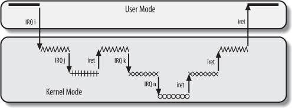

<head>
<link rel='stylesheet' href='/style/github2.css'/>
<meta http-equiv="Content-Type" content="text/html; charset=utf-8" />
</head>

一步步理解Linux之中断和异常
===========================

作者：[gaopenghigh](http://gaopenghigh.github.com)
，转载请注明出处。
[（原文地址）](http://gaopenghigh.github.io/posts/understanding_linux_step_by_step_interrupt.html)

------------------------------------------------

# 中断和异常的概念

* **中断**：
    硬件通过中断来通知内核。中断是一种电信号，由硬件设备生成，并送入中断控制器
    的输入引脚中，中断控制器会给CPU发送一个电信号，CPU检测到这个信号，就中断当
    前的工作转而处理中断。每个中断都通过一个唯一的数字标志。这些中断值称为
    **中断请求（IRQ，Interrupt ReQuest）线**。

* **异常**：
    当CPU执行到由于编程失误而导致的错误指令（比如被0除）的时候，或者在执行期间
    出现踢输情况（如缺叶）而必须靠内核来处理的时候，处理器就产生一个异常。异常
    和中断类似，所以异常也叫“同步中断(asynchronous interrupt)”。内核对异常的处
    理大部分和对中断的处理一样。

## 中断描述符表

中断描述符表（Interrupt Descriptor Table, IDT）是一个系统表，它与每一个中断或异
常向量相联系，每一个向量在表中有相应的中断或异常处理程序的入口地址。IDT的地址存
放在`idtr`寄存器中。中断发生时，内核就从IDT中查询相应中断的处理信息。

## 异常处理

异常处理程序一般由三个部分组成：

1. 在内核堆栈中保存大多数寄存器的内容。（汇编）
2. 用高级的C函数处理异常。
3. 通过`ret_from_exception()`函数从异常处理程序退出。

## 中断处理

### 中断处理程序

在相应一个特定中断时，内核会执行一个函数，这个函数就叫做
**中断处理程序（interrupt handler）**，或者叫做
**中断服务例程（interrupt service routine，ISR）**。

中断处理程序运行在中断上下文中，该上下文中的代码不可以阻塞。要注意，中断处理程
序执行的代码不是一个进程，中断处理程序比一个进程要“轻”。

每个中断和异常都会引起一个内核控制路径，而内核控制路径是可以任意嵌套的。也就是
说，一个中断处理程序可以被另一个中断处理程序“中断”。为了允许这样的嵌套，中断处
理程序就必须永不阻塞，换句话说，进程被中断，在中断程序运行期间，不能发生进程切
换。这是因为，一个中断产生时，内核会把当前寄存器的内容保存在内核态堆栈中，这个
内核态堆栈属于当前进程，嵌套中断时，上一个中断执行程序产生的寄存器内容同样也会
保存在该内核态堆栈，然后从嵌套的下一个中断恢复时，又从内核态堆栈中取出来放进寄
存器中。

一个内核控制路径嵌套执行的示例图如下：

Linux中中断处理程序是无须重入的。当一条中断线上的handler正在执行时，这条中断线
在所有处理器上都会被屏蔽掉。

在/proc/interrupts中可以查看当前系统的中断统计信息。

### 上半部和下半部的概念

有时候中断处理需要做的工作很多，而中断处理程序的性质要求它必须在尽量短的时
间内处理完毕，所以中断处理的过程可以分为两部分或者两半（half）。中断处理程序属
于“上半部（top half）”--接受到一个中断，立刻开始执行，但只做有严格时限的工作。
能够被允许稍微晚一点完成的工作会放到“下半部（bottom half）中去，下半部不会马上
执行，而是等到一个合适的时机调度执行。也就是说，关键而紧急的部分，内核立即执行
，属于上半部；其余推迟的部分，内核随后执行，属于下半部。

比如说当网卡接收到数据包时，会产生一个中断，中断处理程序首要进行的工作是通知硬
件拷贝最新的网络数据包到内存，然后读取网卡更多的数据包。这样网卡缓存就不会溢出
。至于对数据包的处理和其他随后工作，则放到下半部进行。关于下半部的细节，我们后
面会讨论。

### 注册中断处理程序

驱动程序通过`request_irq()`函数注册一个中断处理程序：

    /* 定义在<linux/interrupt.h>中 */
    typedef irqreturn_t (*irq_handler_t)(int, void *);

    int request_irq(ussigned int irq,
                    irq_handler_t handler,
                    unsigned long flags,
                    const char *name,
                    void *dev);

参数解释如下：

* `irq` 要分配的中断号
* `handler` 是指向中断处理程序的指针
* `flags` 设置中断处理程序的一些属性，可能的值如下：

        IRQF_DISABLED       在本次中断处理程序本身期间，禁止所有其他中断。
        IRQF_SAMPLE_RANDOM  这个中断对内核的随机数产生源有贡献。
        IRQF_TIMER          该标志是特别为系统定时器的中断处理准备的。
        IRQF_SHARED         表明多个中断处理程序可以共享这条中断线。也就是说这
                            条中断线上可以注册多个中断处理程序，当中断发生时，
                            所有注册到这条中断线上的handler都会被调用。

* `name` 是与中断相关设备的ASCII文本表示
* `dev` 类似于一个cookie，内核每次调用中断处理程序时，都会把这个指针传递给它，
    指针的值用来表明到底是什么设备产生了这个中断，当中断线共享时，这条中断线上
    的handler们就可以通过dev来判断自己是否需要处理。

### 释放中断处理程序

通过`free_irq`函数注销相应的中断处理程序:

    void free_irq(unsigned int irq, void *dev);

参数和`request_irq`的参数类似。当一条中断线上注册了多个中断处理程序时，就需要
`dev`来说明想要注销的是哪一个handler。

# 下半部（bottom half）

