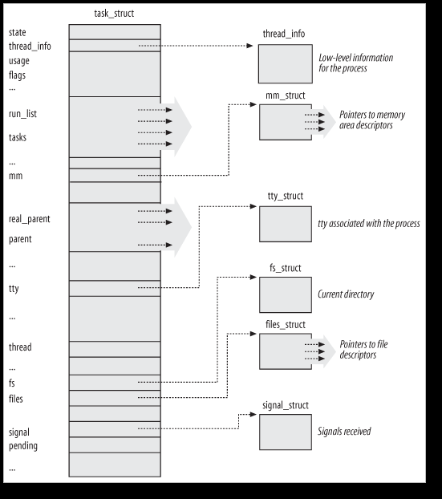
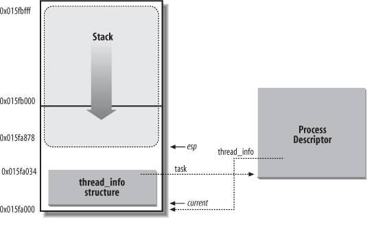
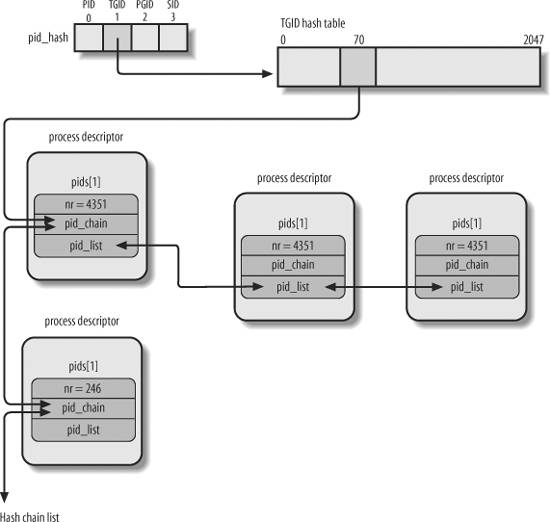
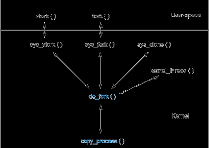

<head>
<link rel='stylesheet' href='/style/github2.css'/>
</head>

一步步理解Linux进程（3）--内核中进程的实现
======================================

## 进程描述符（process descriptor）

内核中，进程的所有信息存放在一个叫做“**进程描述符**”（process descriptor）的struct中，结构名叫做`task_struct`，该结构定义在`<linux/sched.h>`文件中。内核又把所有进程描述符放在一个叫做“任务队列（task list）的双向循环列表中。关于双向循环列表的实现，参见[《内核中双向列表的实现》](http://blog.csdn.net/gaopenghigh/article/details/8830293)。

task_stuct的示意图如下:

## 进程的状态

`task_struct`中的`state`字段描述了该进程当前所处的状态，进程可能的状态必然是下面5种当中的一种：

* `TASK_RUNNING`（运行） -- 进程正在执行，或者在运行队列中等待执行。这是进程在用户空间中唯一可能的状态。
* `TASK_INTERRUPTIBLE`（可中断） -- 进程正在睡眠（阻塞），等待某些条件的达成。一个硬件中断的产生、释放进程正在等待的系统资源、传递一个信号等都可以作为条件唤醒进程。
* `TASK_UNINTERRUPTIBLE`（不可中断） -- 与可中断状态类似，除了就算是收到信号也不会被唤醒或准备投入运行，对信号不做响应。这个状态通常在进程必须在等待时不受干扰或等待事件很快就会发生时出现。例如，当进程打开一个设备文件，相应的设备驱动程序需要探测某个硬件设备，此时进程就会处于这个状态，确保在探测完成前，设备驱动程序不会被中断。
* `__TASK_TRACED` -- 被其它进程跟踪的进程，比如ptrace对程序进行跟踪。
* `__TASK_STOPPED` -- 进程停止执行。通常这种状态发生在接收到SIGSTOP, SIGTSTP, SIGTTIN, SIGTTOU等信号的时候。此外，在调试期间接收到任何信号，都会使进程进入这种状态。

可以通过set_task_state()函数来改变一个进程的状态：

    set_task_state(task, state);

## 线程描述符

与`task_struct`结构相关的一个小数据结构是`thread_info`（线程描述符）。对于每一个进程，内核把它内核态的进程堆栈和进程对应的`thread_info`这两个数据结构紧凑地存放在一个单独为进程分配的存储区域内。X86上，`struct_info`在文件`<linux/thread_info.h>`定义如下:

    /* （LINUX_SRC/arch/x86/include/asm/thread_info.h） */

    struct thread_info {
        struct task_struct  *task;          /* main task structure */
        struct exec_domain  *exec_domain;   /* execution domain */
        __u32   flags;                      /* low level flags */
        __u32   status;                     /* thread synchronous flags */
        __u32   cpu;                        /* current CPU */
        int preempt_count;                  /* 0 => preemptable, <0 => BUG */
        mm_segment_taddr_limit;
        struct restart_blockrestart_block;
        void __user *sysenter_return;
    #ifdef CONFIG_X86_32
        unsigned long   previous_esp;   /* ESP of the previous stack in case of nested (IRQ) stacks */
        __u8supervisor_stack[0];
    #endif
        unsigned intsig_on_uaccess_error:1;
        unsigned intuaccess_err:1;           /* uaccess failed */
    };

内核用一个`thread_unio`n来方便地表示一个进程的`thread_info`和内核栈：

    /* <linux/sched.h> */

    union thread_union {
        struct thread_info thread_info;
        unsigned long stack[THREAD_SIZE/sizeof(long)];
    };

`thread_info`和进程的内核态堆栈在内存中的存放方式如下图：

图中，esp寄存器是CPU栈指针，用来存放栈顶单元的地址。两者紧密结合起来存放的主要好处是：内核很容易从esp寄存器的值获得当前在CPU上正在运行的进程的`thread_info`的地址（例如，如果`thread_unio`n结构长度为2^13字节即8K，那么只要屏蔽掉esp的低13位即可得到对应的`thread_info`的基址），继而可以得到该进程的`task_struct`的地址。对于像x86那样寄存器较少的硬件体系结构，只要通过栈指针就能得到当前进程的`task_struct`结构，避免了使用额外的寄存器专门记录。（对于PowerPC结构，它有一个专门的寄存器保存当前进程的`task_struct`地址，需要时直接取用即可。）

内核中大部分处理进程的代码都是直接通过`task_struct`进行的，可以通过`current`宏查找到当前正在运行进程的`task_struct`。硬件体系不同，该宏的实现不同，它必须针对专门的影印件体系结构做处理。想PowerPC可以直接去取寄存器的值，对于x86，则在内核栈的尾端创建`thread_info`结构，通过计算偏移间接地查找`task_struct`结构，比如上面说的“那么只要屏蔽掉esp的低13位”。

## 进程的标识和定位（PID散列表）

我们知道进程通过PID来标识，PID有个默认的最大值，一般是32768，这个值在`<linux/threads.h>`中定义:

    #define PID_MAX_DEFAULT (CONFIG_BASE_SMALL ? 0x1000 : 0x8000)

也可以通过修改`/proc/sys/kernel/pid_max`的值来提高上限。

为了能高效地从PID导出对应的进程描述符指针（而不是顺序扫描链表），内核引入了4个散列表。（是4个的原因是由于进程描述符中包含了4个不同类型的PID的字段，每种类型的PID需要自己的散列表），这四个散列表存放在`task_struct`结构中的名为pids的成员表示的数组中。

    Hash表的类型   字段名    说明
    PIDTYPE_PID   pid      进程的PID
    PIDTYPE_TGID  tgid     线程组领头进程的PID
    PIDTYPE_PGID  pgrp     进程组领头进程的PID
    PIDTYPE_SID   session  会话领头进程的PID

在`task_struct`中与这4个散列表有关的内容是：

    /* 在linux-3.4.5/include/linux/sched.h中 */
    struct task_struct {
        ... ...
        /* PID/PID hash table linkage. */   
        struct pid_link pids[PIDTYPE_MAX];
        ... ...
    };
    /* 在linux-3.4.5/include/linux/pid.h中 */
    enum pid_type   
    {   
        PIDTYPE_PID,
        PIDTYPE_PGID,   
        PIDTYPE_SID,
        PIDTYPE_MAX 
    };
    struct pid 
    {  
        atomic_t count;
        unsigned int level;
        /* lists of tasks that use this pid */ 
        struct hlist_head tasks[PIDTYPE_MAX];  
        struct rcu_head rcu;   
        struct upid numbers[1];
    };   
    struct pid_link
    {  
        struct hlist_node node;
        struct pid *pid;   
    };

在3.4.5版本的内核中，pid和tgid直接是task_struct结构的成员:

    pid_t pid;
    pid_t tgid;

注意，对于内核来说，线程只是共享了一些资源的进程，也用进程描述符来描述。`getpid`(获取进程ID)系统调用返回的也是`tast_struct`中的`tgid`, 而`tast_struct`中的`pid`则由`gettid`系统调用来返回。在执行ps命令的时候不展现子线程，也是有一些问题的。比如程序a.out运行时，创建 了一个线程。假设主线程的pid是10001、子线程是10002（它们的tgid都是10001）。这时如果你kill 10002，是可以把10001和10002这两个线程一起杀死的，尽管执行ps命令的时候根本看不到10002这个进程。如果你不知道linux线程背后的故事，肯定会觉得遇到灵异事件了。

`pgrp`和`session`是通过下面这两个函数取得的:

    static inline struct pid *task_pgrp(struct task_struct *task)
    {
        return task->group_leader->pids[PIDTYPE_PGID].pid;
    }
    static inline struct pid *task_session(struct task_struct *task)
    {
        return task->group_leader->pids[PIDTYPE_SID].pid;
    }

而`group_leader`是线程组的组长线程的进程描述符，在`task_struct`中定义如下:

    struct task_struct *group_leader;   /* threadgroup leader */

一个PID只对应着一个进程，但是一个PGID，TGID和SID可能对应着多个进程，所以在pid结构体中，把拥有同样PID（广义的PID）的进程放进名为tasks的成员表示的数组中，当然，不同类型的ID放在相应的数组元素中。

考虑下面四个进程：

    进程A: PID=12345, PGID=12344, SID=12300
    进程B: PID=12344, PGID=12344, SID=12300，它是进程组12344的组长进程
    进程C: PID=12346, PGID=12344, SID=12300
    进程D: PID=12347, PGID=12347, SID=12300

分别用`task_a`, `task_b`, `task_c`和`task_d`表示它们的`task_struct`，则它们之间的联系是：

    task_a.pids[PIDTYPE_PGID].pid.tasks[PIDTYPE_PGID]指向有进程A-B-C构成的列表
    task_a.pids[PIDTYPE_SID].pid.tasks[PIDTYPE_SID]指向有进程A-B-C-D构成的列表

内核初始化期间动态地为4个散列表分配空间，并把它们的地址存入`pid_hash`数组。

内核用`pid_hashf`n宏把PID转换为表索引(kernel/pid.c):

    #define pid_hashfn(nr, ns)  \
        hash_long((unsigned long)nr + (unsigned long)ns, pidhash_shift)

这个宏就负责把一个PID转换为一个index，关于`hash_long`函数以及内核中的hash算法，可以参考[《Linux内核中hash函数的实现》](http://gaopenghigh.github.com/posts/understanding_linux_step_by_step_kernel_2_hash.html)

现在我们已经可以通过`pid_hashfn`把PID转换为一个index了，接下来我们再来想一想其中的问题。

对于内核中所用的hash算法，不同的PID/TGID/PGRP/SESSION的ID（没做特殊声明前一般用PID作为代表），有可能会对应到相同的hash表索引，也就是冲突（colliding）。于是一个index指向的不是单个进程，而是一个进程的列表，这些进程的PID的hash值都一样。`task_struct`中pids表示的四个列表，就是具有同样hash值的进程组成的列表。

比如进程A的`task_struct`中的`pids[PIDTYPE_PID]`指向了所有PID的hash值都和A的PID的hash值相等的进程的列表，`pids[PIDTYPE_PGID]`指向所有PGID的hash值与A的PGID的hash值相等的进程的列表。需要注意的是，与A同组的进程，他们具有同样的PGID，更具上面所解释的，这些进程构成的链表是存放在A的`pids[PIDTYPE_PGID].pid.tasks`指向的列表中。

下面的图片说明了hash和进程链表的关系，图中TGID=4351和TGID=246具有同样的hash值。（图中的字段名称比较老，但大意是一样的，只要把`pid_chain`看做是`pid_link`结构中的node，把`pid_list`看做是pid结构中的tasks即可）

处理PID散列表的函数和宏：

* `do_each_task_pid(nr, type, task) while_each_task_pid(na, type, task)`
    
    循环作用在PID值等于nr的PID链表上，链表的类型由参数type给出，task指向当前被扫描的元素的进程描述符。

* `find_task_by_pid_type(type, nr)`

    在type类型的散列表中查找PID等于nr的进程。

* `find_tsk_by_pid(nr)`

    同find_task_by_pid_type(PIDTYPE_PID, nr)

* `attach_pid(task, type, nr)`

    把task指向的PID等于nr的进程描述符插入type类型的散列表中。

* `detach_pid(task, type)`

    从type类型的PID进程链表中删除task所指向的进程描述符。

* `next_thread(task)`

    返回PIDTYPE_TGID类型的散列表链表中task指示的下一个进程。

## fork()的实现

Linux通过`clone()`系统调用实现`fork()`。这个调用通过一系列的参数标志来指明父、子进程需要共享的资源。
`fork()`, `vfork()`, `__clone()`库函数都根据各自需要的参数标志去调用clone(), 然后由`clone()`去调用`do_fork()`。

之前我们讨论过Linux中的线程就是共享了一些资源的进程，所以只要设置对参数，即指定特别的`clone_flags`就能创建一个线程，就能通过`clone()`系统调用创建线程。

Linux的`fork()`使用“**写时拷贝**”（copy-on-write）来实现，这是一种可以推迟甚至免除拷贝数据的技术。也就是说，内核此时并不赋值整个进程地址空间，而是让父进程和子进程共享同一个拷贝。只有在需要写入时，数据才会被复制，从而使各个进程拥有各自的拷贝，在此之前，只是以只读的方式共享。在页根本不会被写入的情况下（比如`fork()`之后立即调用`exec()`）它们就无需复制了。

### clone()参数的标志如下：

    参数标志              含义
    CLONE_FILES          父子进程共享打开的文件
    CLONE_FS             父子进程共享文件系统信息
    CLONE_IDLETASK       将PID设置为0(只供idle进程使用)TODO
    CONE_NEWNS           为子进程创建新的命名空间（即它自己的已挂载文件系统视图），不能同时设置CLONE_FS和CLONE_NEWNS
    CLONE_PARENT         指定子进程鱼父进程拥有同一个父进程。即设置子进程的父进程（进程描述符中的parent和real_parent字段）为调用进程的父进程
    CLONE_PTRACE         继续调试子进程。如果父进程被跟踪，则子进程也被跟踪
    CLONE_SETTID         将TID回写致用户空间。TODO
    CLONE_SETTLS         为子进程创建新的TLS
    CLONE_SIGHAND        父子进程共享信号处理函数及被阻断的信号
    CLONE_SYSVSEM        父子进程共享SYstem V SEM_UNDO 语义。TODO
    CLONE_THREAD         父子进程放入相同的线程组
    CLONE_VFOK           调用vfork()，所以父进程准备睡眠等待子进程将其唤醒
    CLONE_UNTRACED       防止跟踪进程在子进程上强制执行CLONE_PTRACE，即使CLONE_PTRACE标志失去作用
    CLONE_STOP           以TASK_STOPED状态开始进程
    CLONE_CHILD_CLEARTID 清除子进程的TID TODO
    CLONE_CHILD_SETTID   设置子进程的TID
    CLONE_PARENT_SETTID  设置父进程的TID
    CLONE_VM             父子进程共享地址空间

负责创建进程的函数的层次结构入下图：

### do_fork()

核心的函数`do_fork`主要工作内容如下：

做一些权限和用户态命名空间的检查(TODO), 调用`copy_process`函数得到新进程的进程描述符，如果`copy_process`返回成功，则唤醒新进程并让其投入运行。内核有意选择子进程首先执行。因为一般子进程会马上调用exec()函数，这样可以避免写时拷贝的额外开销。现在我们再来看一看`copy_process()`函数到底做了些什么。

### copy_process()

`copy_process()`创建子进程的进程描述符以及执行它所需要的所有其它内核数据结构，但并不真的执行子进程，这个函数非常复杂，它的主要步骤如下：

1. 检查参数`clone_flags`所传递标志的一致性。标志必须遵守一定的规则，不符合这些规则的话它就返回错误代号。
2. 调用`security_task_create()`以及稍后调用的`security_task_alloc()`执行所有附加的安全检查。
3. 调用`dup_task_struct()`为新进程创建一个内核栈、`thread_info`结构和`task_struct`, 这些值与当前进程的值相同。此时，子进程和父进程的进程描述符是完全相同的。`dup_task_struct()`的工作如下：
    1. `prepare_to_copy()`, 如果有需要，把一些寄存器(FPU)2的内容保存到父进程的`thread_info`结构中，稍后，这些值会复制到子进程的`thread_info`结构中；
    2. `tsk = alloc_task_struct()`; 获得task_struct结构, `ti = alloc_thread_info()`; 获得`task_info`结构, 把父进程的值考到新的结构中，并把tsk和ti链接上：`tsk->thread_info = ti;ti->task = tsk;`
    3. 把新进程描述符的使用计数器（`tsk->usage`）置为2，用来表示进程描述符正在被使用而且其相应的进程处于活动状态。
    4. 返回`tsk`.
4. 检查并确保新创建这个子进程后，当前用户所拥有的进程数目没有超出给它分配的资源的限制。
5. 检查系统中的进程数量是否超过`max_threads`变量的值。系统管理员可以通过写`/proc/sys/kernel/threads-max`文件来改变这个值。
6. 新进程着手使自己与父进程区别开来。进程描述符内的许多成员都要被清0或设为初始值。那些不是从父进程继承而来的成员，主要是些统计信息，大部分的数据依然未被修改。根据传递给`clone()`的参数标志，`copy_process()`拷贝或共享打开的文件、文件系统信息、信号处理函数、进程地址空间和命名空间等。一般情况下，这些资源是会在给定进程的所有线程之间共享的，不能共享的资源则拷贝到新进程里面去。
7. 调用`sched_fork()`函数，把子进程状态设置为`TASK_RUNNING`，并完成一些进程调度需要的初始化。
8. 根据`clone_flags`做一些进程亲子关系的初始化，比如`clone_flags`中有`CLONE_PARENT|CLONE_THREA`D，则把子进程的`real_parent`的值等于父进程的`real_parent`的值。
9. 根据flags对是否需要跟踪子进程做一些初始化；
10. 执行`SET_LINKS()`宏把新进程描述符插入进程链表，`SET_LINKS`宏定义在<linux/sched.h>中。
11. 判断子进程是否要被跟踪，做一些设置。
12. 调用`attch_pid()`把新进程描述符插入到`pidhash[PIDTYPE_PID]`散列表。
13. 做一些扫尾工作，修改一些计数器的值，并返回新进程的进程的进程描述符指针`tsk`。在`copy_process()`函数成功返回后，`do_fork()`函数将唤醒新创建的进程并投入运行。

## 内核线程

内核通过内核线程(kernel thread)来完成一些经常需要在后台完成的操作，比如刷缓存，高级电源管理等等。内核线程和普通进程的区别在于内核线程没有独立的地址空间，它只在内核态运行。

内核线程只能由其它内核线程创建，内核是通过从kthreadd内核进程中衍生出所有新的内核线程来自动处理这一点的。创建一个新的内核线程的方法如下：

    /* <linux/kthread.h> */
    struct task_struct *kthread_create(int (*threadfn)(void *data),
                       void *data,
                       const char namefmt[], ...);

新的任务是由`kthread`内核进程通过`clone()`系统调用创建的，新进程创建后处于不可运行状态，需要用`wake_up_process()`来唤醒，唤醒后，它运行`threadfn`函数，以`data`作为参数，新内核线程的名字叫`namefmt`。

### 进程0
所有进程都是由一个pid=0的祖先繁衍出来的，它叫做进程0，它是Linux在初始化阶段从无到有造出来的，使用的是静态的数据结构（其他进程的数据结构都是动态分配的）。

### 进程1
进程0会创建一个新进程：进程1，也就是init进程，init进程被调度到后会运行init()方法，完成内核的初始化，然后用`execve()`系统调用装入可执行程序init，于是init进程从内核线程转变为普通进程。

## 进程终结

所有进程的终止都是由 `do_exit()`函数来处理的（位于`<kernel/exit.c>`）。

这个函数从内核数据结构中删除对终止进程的大部分引用，注意`task_struct`和`thread_info`并没有被删除，这些信息在父进程调用wait系列函数时仍然需要。

需要注意的是，`do_exit()`中会调用`exit_notify()`函数向父进程发送信号，给它的子进程重新寻找养父，养父为线程组中的其它进程，找不到时则为`init`进程，并把进程状态(`task_struct`结构中的`exit_state`成员)设成`EXIT_ZOMBIE`。然后，`do_exit()`调用`schedule()`切换到新的进程。

这样与进程相关联的所有资源都被释放掉了（当然预其它进程共享的资源不会被释放）。进程不可运行（实际上也没有地址空间让它运行）并处于`EXIT_ZOMBIE`状态。它占用的所有内存就是内核栈、`thread_info`结构和`task_struct`结构。当父进程发出了与被终止进程相关的`wait()`类系统调用之后，这些内存才会被释放。

JH, 2013-04-21

----
参考资料：

* 《深入理解Linux内核》
* 《Linux内核设计与实现》
