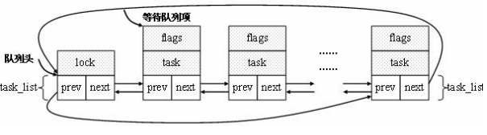

<head>
<link rel='stylesheet' href='/style/github2.css'/>
</head>

一步步理解Linux进程（4）--等待队列和进程切换
=======================================

作者：[gaopenghigh](http://gaopenghigh.github.com)
，转载请注明出处。
[（原文地址）](http://gaopenghigh.github.io/posts/understanding_linux_step_by_step_process_4_wait_queue_and_process_switch.html)

## 等待队列

假如一个进程去读一个磁盘上的文件，但是这个磁盘反应比较慢（相对于CPU来说），这是进程不能马上读取到数据，于是被阻塞了。此时内核一般会把这个进程的状态设置为睡眠`TASK_INTERRUPTIBLE`或者`TASK_UNINTERRUPTIBLE`，然后把这个进程放入等待队列里面，直到数据读取出来了才再次运行。

等待队列表示一组睡眠的进程，当某一条件变为真时，由内核唤醒它们。

### 等待队列的使用

假如我们定义了一个函数write_to_buffer()把数据写入一个缓存区，但当这个缓存区已满时我们希望这个函数阻塞住，直到缓存区有空间。缓存区是否满由一个变量is_full表示。则大致的实现如下：

    /* 建立并初始化一个等待队列头，当然也可以选用已经存在的等待队列 */
    DECLARE_WAIT_QUEUE_HEAD(wq);
    /* 建立一个等待队列项 */
    wait_queue_t my_wait;
    /* 用当前进程的进程描述符初始化这个等待队列项 */
    init_wait(&my_wait);
    /* 将等待队列项添加到等待队列头中，并设置进程的状态 */
    prepare_to_wait(&wq, my_wait, state);
    /* 调用schedule，告诉内核调用其他的进程执行 */
    schedule();
    /* schedule返回，完成后续清理工作 */
    finish_wait();

等待队列由“等待队列头（`struct wait_queue_head_t`）”和“等待队列项（`struct wait_queue_t`）”组成。

schedule函数是内核的进程调度函数，当它被调用是，内核会按照一定的调度算法选择出下一个执行的进程，然后进行进程切换的操作。schedule返回后，说明这个进程醒来了（需要的条件成立了）并且被内核选中开始执行了。

### 等待队列的操作

2.6内核提供如下关于等待队列的操作：

* 定义和初始化“等待队列头”

        wait_queue_head_t my_queue;
        init_waitqueue_head(&my_queue);
        或者调用宏:
        DECLARE_WAIT_QUEUE_HEAD(my_queue);

* 定义并初始化“等待队列项”

        DECLARE_WAITQUEUE(name, tsk);

    其中name是类型为“struct wait_queue_t”的指针，tsk类型为“struct task_struct”的指针

* 添加/移除“等待队列项”

        void fastcall add_wait_queue(wait_queue_head_t *q, wait_queue_t *wait);
        void fastcall remove_wait_queue(wait_queue_head_t *q, wait_queue_t *wait);

* 等待事件

        wait_event(wq, condition);                               /* 不可中断的等待 */
        wait_event_interruptible(wq, condition)                  /* 可中断的等待 */
        wait_event_timeout(wq, condition, timeout)               /* 带超时返回的等待 */
        wait_event_interruptible_timeout(wq, condition, timeout) /* 可中断并超时返回的等待 */

* 唤醒队列

        wake_up(wait_queue_head_t *q) ;              /* 唤醒q上所有等待的进程 */ 
        wake_up_interruptible(wait_queue_head_t *q); /* 只唤醒q上执行可中断休眠的进程 */

### 等待队列的内核实现

#### 等待队列头

等待队列由双向链表实现，每一个等待队列都有一个等待队列头(wait queue head), 其类型是名为`wait_queue_head_t`的数据结构:

    /* <linux/wait.h> */
    struct __wait_queue_head {
        spinlock_t lock;              /* 自旋锁 */
        struct list_head task_list;   /* 指向链表 */
    };
    typedef struct __wait_queue_head wait_queue_head_t;

由于等待队列是由中断处理程序和主要内核函数修改的，所以必须对链表进行保护，防止它被同时访问，这样的同步是通过`wait_queue_head`结构中的`lock`自旋锁实现的。`task_list`是等待进程链表的头。

#### 等待队列项

等待队列项的数据结构是`wait_queue_t`，定义如下：

    /* linux/wait.h> */
    typedef struct __wait_queue wait_queue_t;
    struct __wait_queue {
        unsigned int flags;
        #define WQ_FLAG_EXCLUSIVE   0x01
        void *private;
        wait_queue_func_t func;
        struct list_head task_list;
    };

各个字段的解释：

* `private`

    等待队列项代表一个睡眠的进程。在`wait_queue_t`结构中，这个进程的进程描述符的地址存放在private字段中。

* `flags`

    有的时候，如果有两个或者多个进程等待互斥访问某一要释放的资源，这时候，就只需要唤醒其中的一个进程，不然全部唤醒的话，它们又会去抢着用那个资源，最后的结果是只有一个进程抢到，其它进程又要去睡觉，白白醒来一次耗费资源。为了解决这样的问题，内核把睡眠进程分为两种：互斥进程（等待队列元素中flags字段为1）和非互斥进程（flags字段为0），互斥进程由内核有选择地唤醒，而非互斥进程则由内核一次全部唤醒。

* `func`

    `wait_queue_t`中，func字段标识等待队列中的睡眠进程应该用什么方式来唤醒

#### 等待队列结构图

整个等待队列的结构如下图所示：

#### 等待队列操作的实现

下面我们看几个等待队列的主要操作的实现：

* `DECLARE_WAIT_QUEUE_HEAD(name)`宏

        /* SRC/include/linux/wait.h */
        #define __WAIT_QUEUE_HEAD_INITIALIZER(name) {   \   
            .lock   = __SPIN_LOCK_UNLOCKED(name.lock),  \   
            .task_list  = { &(name).task_list, &(name).task_list } }
       
        #define DECLARE_WAIT_QUEUE_HEAD(name) \ 
            wait_queue_head_t name = __WAIT_QUEUE_HEAD_INITIALIZER(name)

* `init_wait(wait)`宏

        #define init_wait(wait) \   
            do {\   
                (wait)->private = current;  \   
                (wait)->func = autoremove_wake_function;\   
                INIT_LIST_HEAD(&(wait)->task_list); \   
                (wait)->flags = 0;  \   
            } while (0)

* `ECLARE_WAITQUEUE(name, tsk)`宏

        #define __WAITQUEUE_INITIALIZER(name, tsk) {\   
            .private= tsk,  \   
            .func   = default_wake_function,\   
            .task_list  = { NULL, NULL } }  
    
        #define DECLARE_WAITQUEUE(name, tsk)\   
            wait_queue_t name = __WAITQUEUE_INITIALIZER(name, tsk) 

* `wait_event(wq, condition)`宏

        #define __wait_event(wq, condition)                     \                       
            do {                                    \                                       
                DEFINE_WAIT(__wait);                        \                               
                                    \                                           
                for (;;) {                          \                                       
                    prepare_to_wait(&wq, &__wait, TASK_UNINTERRUPTIBLE);    \               
                    if (condition)                      \                                   
                        break;                      \                                       
                    schedule();                     \                                       
                }                               \                                           
                finish_wait(&wq, &__wait);                  \                               
            } while (0)

        #define wait_event(wq, condition)                   \                           
            do {                                    \                                       
                if (condition)                          \                                   
                    break;                          \                                       
                __wait_event(wq, condition);                    \                           
            } while (0)

## 进程切换

为了控制进程的执行，内核必须有能力挂起正在CPU上运行的进程，并恢复以前挂起的某个进程的执行。

### 进程上下文和硬件上下文

一般的程序在用户空间执行，当一个程序执行了系统调用或者出发了某个异常，它就陷入了内核空间。此时，我们称内核“代表进程执行”并处于进程上下文中。在此上下文中current宏是有效的。除非在此间隙有更高优先级的进程需要执行并由调度器做出了相应调整，否则在内核退出的时候，程序恢复在用户空间继续执行。

每个进程可以拥有自己的地址空间，但所有进程必须共享CPU寄存器。所以，在恢复一个进程执行之前，必须确保每个寄存器装入了挂起进程时的值。这组必须装入寄存器的数据就称为硬件上下文（hardware context）。

### 任务状态段

TSS 全称task state segment，是指在操作系统进程管理的过程中，任务（进程）切换时的任务现场信息。内核为每个CPU创建一个TSS。每个TSS有它自己的8字节的任务状态段描述符(Task State Segment Descriptor, TSSD)。

TSS在任务切换过程中起着重要作用，通过它实现任务的挂起和恢复。在任务切换过程中，首先，处理器中各寄存器的当前值被自动保存到TR（任务寄存器）所指向的TSSD代表的TSS中，然后，下一任务的TSS的TSSD被装入TR；最后，从TR所指定的TSSD代表的TSS中取出各寄存器的值送到处理器的各寄存器中。由此可见，通过在TSS中保存任务现场各寄存器状态的完整映象，实现任务的切换。Linux创建的TSSD存放在全局描述符表（GDT）中，GDT的基地址存放在每个CPU的gdtr寄存器中。每个CPU的tr寄存器包含相应TSS的TSSD选择符，事实上还存了两个隐藏的非编程字段：TSSD的Base字段（指向对应的TSS的地址）和Limit字段，这样CPU就可以直接对TSS寻址而不用从GDT中检索TSS的地址。

在每次进程切换时，被替换进程的硬件上下文必须保存在某个地方，这个地方就是进程描述符的类型为`thread_struct`的thread字段：

    /* <linux/sched.h> */
    struct task_struct {
        ...
        /* CPU-specific state of this task */
        struct thread_struct thread;
        ...
    }

这个数据结构包含的字段涉及大部分CPU寄存器，但不包括诸如`eax`、`ebx`等等这些通用寄存器，它们的值保留在内核堆栈中。

### 执行进程切换

本质上说，每个进程切换由两步组成：

1. 切换页全局目录以安装一个新的地址空间；
2. 切换内核态堆栈和硬件上下文。

第一个步骤我们暂时不讨论，我们先来简单看看第二步的具体过程。

这个过程由`switch_to`宏执行，该宏有3个参数：`prev`，`next`和`last`，`prev`表示当前的进程描述符，`next`表示准备切换到的进程的进程描述符，`last`表示这次切换发生后`eax`寄存器的值所存的地方（注意，在进程切换时，`eax`、`ebx`等等这些通用寄存器的值是不变的）。

`last`有什么意义呢？我们看一个例子：进程A切换到进程B，再切换到C进程，最后又从进程C切换回进程A。切换回A后，寄存器和thread字段的值都是当初冻结A时的值，也就是prev=A，next=B，这样我们就找不到C了，而找到C在进程调度的过程中很有用，我们需要有个地方来存当前进程到底是从哪个进程切换过来的，这就是last的作用。具体过程如下（由`switch_to`宏执行）：

1. 把当前进程A的prev的值存入eax寄存器，eax=A；
2. 进程切换到B，prev=B，把eax的值读入到last，last=A；
3. 此时需要切换到进程C，把prev的值存到eax，eax=B；
4. 进程切换到C，prev=C，把eax的值读入到last，last=B；
5. 此时需要切换回进程A，把prev的值存入eax，eax=C；
6. 切换到进程A，prev=A，把eax的值读入last，last=C； 这样在进程A中，通过last就可以直达它是从哪个进程切换过来的。

### 进程切换示例图：

具体的切换由一系列的各种寄存器的值的切换组成，在此我们不做深入研究。

JH, 2013-04-22

----

参考资料：

* 《深入理解Linux内核》
* 《Linux内核设计与实现》
* [Linux内核等待队列机制介绍](http://soft.chinabyte.com/os/81/12374081.shtml)

----

